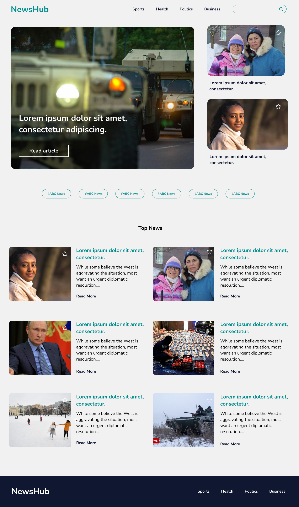

# News Hub
Your credible news source

## Description
A flask web application where users can view the latest news from different sources.

## Setup Requirements
* Git
* Web-browser or your choice
* Flask(1.1.4)
* Pip
* Python 3.8
* News ApiKey (https://newsapi.org/)

# Setup / Installation
* clone the repo:

```shell
git clone https://github.com/james-muriithi/news-hub.git
```

```shell
$foo~bar: cd news-hub
```
* create virtual environment 
```shell
$foo~bar: python3.8 -m venv --without-pip venv
```

* To activate the virtual environment
```shell
$foo~bar: source venv/bin/activate
```

* install the packages from requirements.txt
```shell
$foo~bar: pip install -r requirements.txt 
```

* setup environment variables
```shell
cp .env.example .env
```
* Execute the shell script and start the server
```shell
$foo~bar: chmod a+x start.sh
$foo~bar: ./start.sh
```
* open the browser and navigate to http://127.0.0.1:5000/ to see the application in action

## Technologies Used
The following languages have been used on this project:

* HTML
* CSS
* JS
* Bootstrap
* Flask
* Python
* News Api

## Demo
[Here is a demo of the deployed website](https://news-hub-254.herokuapp.com/)

## Design


## Screenshot


## Support and contact details
To make a contribution to the code used or any suggestions you can click on the contact link and email me your suggestions.

- Email: james.muthike@student.moringaschool.com

## License

Copyright (c) 2021 Moringa school

Permission is hereby granted, free of charge, to any person obtaining a copy
of this software and associated documentation files , to deal
in the Software without restriction, including without limitation the rights
to use, copy, modify, merge, publish, distribute, sublicense, and/or sell
copies of the Software, and to permit persons to whom the Software is
furnished to do so, subject to the following conditions:

The above copyright notice and this permission notice shall be included in all
copies or substantial portions of the Software.

THE SOFTWARE IS PROVIDED "AS IS", WITHOUT WARRANTY OF ANY KIND, EXPRESS OR
IMPLIED, INCLUDING BUT NOT LIMITED TO THE WARRANTIES OF MERCHANTABILITY,
FITNESS FOR A PARTICULAR PURPOSE AND NONINFRINGEMENT. IN NO EVENT SHALL THE
AUTHORS OR COPYRIGHT HOLDERS BE LIABLE FOR ANY CLAIM, DAMAGES OR OTHER
LIABILITY, WHETHER IN AN ACTION OF CONTRACT, TORT OR OTHERWISE, ARISING FROM,
OUT OF OR IN CONNECTION WITH THE SOFTWARE OR THE USE OR OTHER DEALINGS IN THE
SOFTWARE.